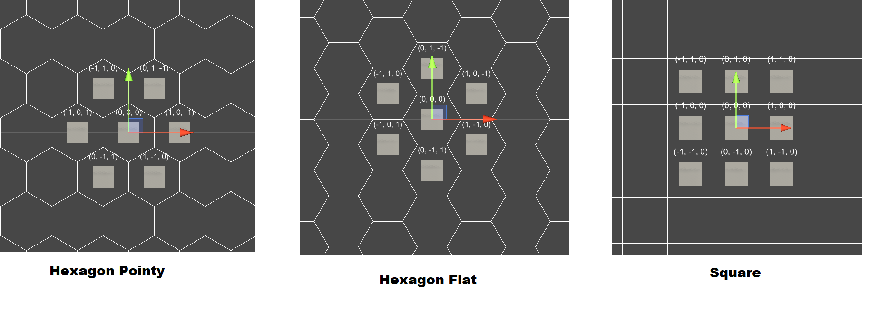
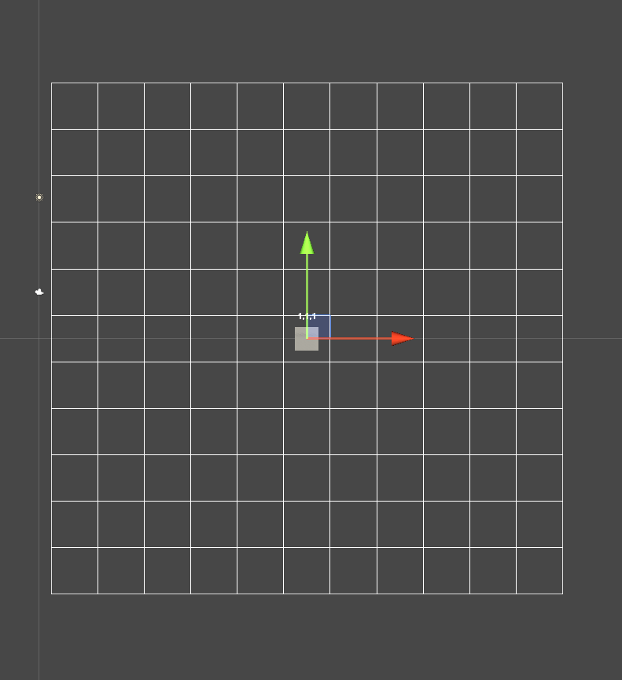
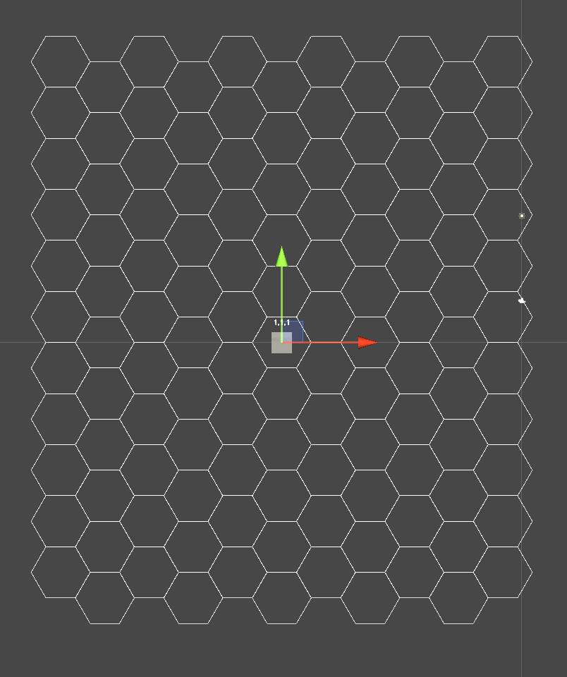
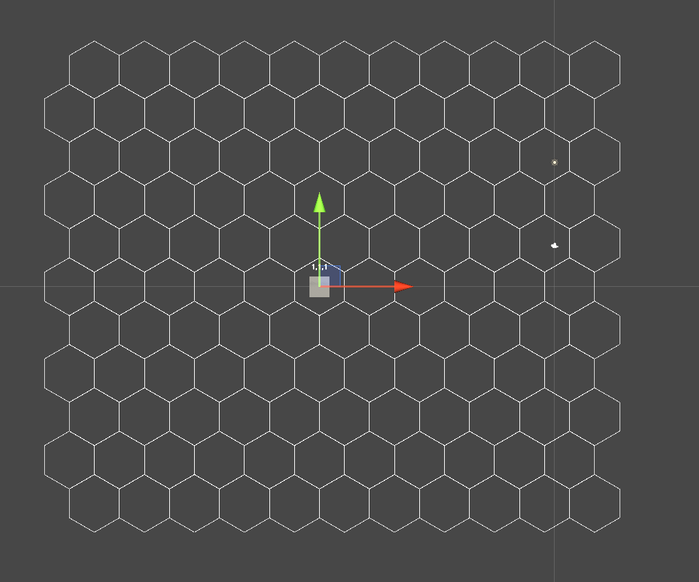

[](https://github.com/semantic-release/semantic-release)
[](https://openupm.com/packages/com.hgs.grid/)

# Introduction

**HGS Grid** has implements hexagonal and squared matrix based on [www.redblobgames.com/grids/hexagons](https://www.redblobgames.com/grids/hexagons/).

## Coord System

For convenience this package uses [Cube Coordinates](https://www.redblobgames.com/grids/hexagons). You can define coordinates using `Vector3Int`.

For sample:

```cs
var center = new Vector3Int(0,0,0);
var left = new Vector3Int(-1,0,1);
var right = new Vector3Int(1,0,-1);
```

## MultiGrid

This component is used to manage a coord system, you can easily convert `Cube Coordinate` to `Unity World Position` and vice versa.

### Attributes

| Attribute    | Type      | Description                             |
| ------------ | --------- | --------------------------------------- |
| `cellSize`   | `Vector3` | Size of cell inside grid                |
| `cellLayout` | `Enum`    | Change grid layout to hexagonor squared |

### Methods

| Attribute                      | Type         | Description                                         |
| ------------------------------ | ------------ | --------------------------------------------------- |
| `GetLines()`                   | `Vector3[]`  | Get all sides of cell inscribed inside circle.      |
| `GetCorners()`                 | `Vector3[]`  | Get all corner of cell inscribed inside circle      |
| `GetCorner(int corner)`        | `Vector3`    | Get specific corner of cell inscribed inside circle |
| `CellToWorld(Vector3Int cell)` | `Vector3`    | Converts a Cube Coordinate to Unity World Position  |
| `WorldToCell(Vector3 world)`   | `Vector3Int` | Converts a Unity World Position to Cube Coordinate  |

### Cell Layouts



### Coordinate to World Space

To convert a coordinate to Unity World Space, you can:

```cs
public class CoordSetter: MonoBehaviour
{
  [SerializeField] MultiGrid grid;

  void Start(){
    var coord = new Vector3Int(0,0,0);
    var worldPos = grid.CellToWorld(coord);
    transform.position  = worldPos;
  }
}
```

### World Space to Coord

To extract a coordinate from Unity World Space, you can:

```cs
public class CoordGetter: MonoBehaviour
{
  [SerializeField] MultiGrid grid;

  void Start(){
    var coord = grid.WorldToCell(transform.position);
    Debug.Log("Coord: "+coord);
  }
}
```

## ShapeUtility

With `ShapeUtility`, you can iterate shapes without complexity.:

### Draw Square

```cs
ShapeUtility.Square(
  left: -5,
  right: 5,
  top: -5,
  bottom: 5,
  // DrawCell doesn't exists, it's just a pseudocode
  callback: (coord) => Gizmos.DrawCell(coord);
);
```

Result on screen:



### Draw Square Hex Flat

```cs
ShapeUtility.SquareHexFlat(
  left: -5,
  right: 5,
  top: -5,
  bottom: 5,
  // DrawCell doesn't exists, it's just a pseudocode
  callback: (coord) => Gizmos.DrawCell(coord);
);
```

Result on screen:



### Draw Square Hex Pointy

```cs
ShapeUtility.SquareHexPointy(
  left: -5,
  right: 5,
  top: -5,
  bottom: 5,
  // DrawCell doesn't exists, it's just a pseudocode
  callback: (coord) => Gizmos.DrawCell(coord);
);
```

Result on screen:



## Map

## Installation

OpenUPM:

`openupm add com.hgs.grid`

Package Manager:

`https://github.com/homy-game-studio/hgs-unity-grid.git#upm`

Or specify version:

`https://github.com/homy-game-studio/hgs-unity-grid.git#1.0.0`

# Samples

You can see all samples directly in **Package Manager** window.

# Contrib

If you found any bugs, have any suggestions or questions, please create an issue on github. If you want to contribute code, fork the project and follow the best practices below, and make a pull request.

## Namespace Convention

To avoid script collisions, all scripts of this package is covered by `HGS.GridSystem` namespace.

## Branchs

- `master` -> Keeps the unity project to development purposes.
- `upm` -> Copy of folder content `Assets/Package` to release after pull request in `master`.

Whenever a change is detected on the `master` branch, CI gets the contents of `Assets/Package`, and pushes in `upm` branch.

## Commit Convention

This package uses [semantic-release](https://github.com/semantic-release/semantic-release) to facilitate the release and versioning system. Please use angular commit convention:

```
<type>(<scope>): <short summary>
  │       │             │
  │       │             └─⫸ Summary in present tense. Not capitalized. No period at the end.
  │       │
  │       └─⫸ Commit Scope: Namespace, script name, etc..
  │
  └─⫸ Commit Type: build|ci|docs|feat|fix|perf|refactor|test
```

`Type`.:

- build: Changes that affect the build system or external dependencies (example scopes: package system)
- ci: Changes to our CI configuration files and scripts (example scopes: Circle, - BrowserStack, SauceLabs)
- docs: Documentation only changes
- feat: A new feature
- fix: A bug fix
- perf: A code change that improves performance
- refactor: A code change that neither fixes a bug nor adds a feature
- test: Adding missing tests or correcting existing tests
